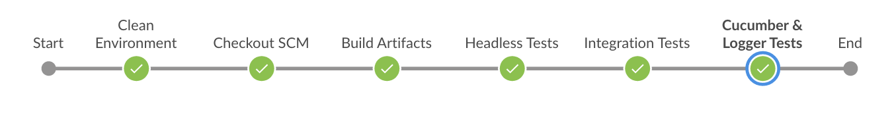

# Continuous Integration Process

This document explains the fabric-sdk-node Jenkins pipeline flow and FAQ's on the
build process to help developer to get more femilarize with the process flow.

To manage CI jobs, we use [JJB](https://docs.openstack.org/infra/jenkins-job-builder).
Please see the pipeline job configuration template here https://ci-docs.readthedocs.io/en/latest/source/pipeline_jobs.html#job-templates.

## CI Pipeline flow

- Every Gerrit patchset triggers a verify job and run the below tests from the `Jenkinsfile`

  - gulp test-headless
  - gulp test-integration,
  - gulp run-test-cucumber
  - gulp run-test-logger targets to run sdk-node tests.

#### Supported platforms

- x86_64
- s390x (Not for every patchset but run tests in daily builds)

#### CI Process Flow

As we trigger `fabric-sdk-node-verify-x86_64` pipeline jobs for every gerrit patchset, we execute
the pipeline stages in the below order.

All the above tests run on the Hyperledger infarstructure x86_64 build nodes. All these nodes uses
the packer with pre-configured software packages. This helps us to run the tests in much faster than
installing required packages everytime.

Below steps shows what each stage does in the Jenkins pipeline verify and merge flow. Every
Gerrit patchset triggers the fabric-sdk-node-verify-x86_64 job and runs the below tests on x86_64 platform.
Before execute the below tests, it clean the environment (Deletes the left over build artifiacts) and
clone the repository with the Gerrit Refspec.

 **VERIFY FLOW**

    CleanEnvironment -- OutputEnvironment -- Checkout SCM -- Build Artifacts -- Headless Tests -- Integration Tests -- Cucumber & Logger Tests

and the below is the series of stages for the merge job flow. (`fabric-sdk-node-merge-x86_64`)

 **Merge FLOW**

    CleanEnvironment -- OutputEnvironment -- Checkout SCM -- Build Artifacts -- Headless Tests -- Integration Tests -- Cucumber & Logger Tests -- Publish NPM modules -- Publish API Docs

- After cleanEnvironment and Display the environment details on the Jenkins console, CI scripts
  fetches the Gerrit refspec and try to execute **Headless and Integration Tests**. `docker-ready`
  is a gulp sub target which will try to pull release-1.4 latest stable images from Hyperledger DockerHub.
  Once the tests are executed successfully, the condition checks whether it is a verify or merge.
  If it is a merge job, Jenkins triggers the **publish npm modules** and **api docs** stages and
  publishes the npm modules and api docs to gh-pages.

  Note: Script provides an option to build the images on the latest fabric commit and run sdk-node
  tests. For this you have to modify **IMAGE_SOURCE** to **build** in the ci.properties file.
  If you would like to pull images from nexus change **IMAGE_SOURCE** to **nexus**. Though we pull
  the images from nexus with this change, in release branches sdk gulp file pulls the images from
  dockerhub. So till we change the build process in the gulp file, let's pull these images from
  docker hub.

- Snapshot npm modules can be seen here. https://www.npmjs.com/package/fabric-client, https://www.npmjs.com/package/fabric-ca-client etc..

- API docs can be accessible from https://fabric-sdk-node.github.io/release-1.4/index.html

See below **FAQ's** to contribute to CI changes.

## FAQ's

#### Trigger failed jobs through gerrit comments

Developers can re-trigger the failed verify jobs by post **reverify** as a comment phrase to the
gerrit change set that retriggers all the verify jobs. To do so, follow the below process:

Step 1: Open the gerrit patch set for which you want to reverify the build

Step 2: Click on Reply, then type **reverify** and click on post

This kicks off all the fabric-sdk-node verify jobs. Once the build is triggered, you can observe
the Jenkins console output, if you are interested in viewing the log messages to determine how well
the build jobs are progressing.

Developer can post below comments to trigger the particular failed build:

    reverify-x or reverify - to restart the build on sdk-node-verify x86_64 platform.
    remerge-x or remerge - to restart the build on sdk-node-verify x86_64 platform.

#### Where to see the output of the stages?

Piepline supports two views (stages and blueocean). **Staged views** shows on the Jenkins job main
page and it shows each stage in the order and the status. For better view, we suggest you to access
the BlueOcean plugin. Click on the JOB Number and click on the **Open Blue Ocean** link that
shows the build stages in pipeline view. Also, we capture the `.logs files` and keep them on
the Job console.

#### How to add more stages to this pipeline flow?

We use scripted pipeline syntax with groovy and shell scripts. Also, we use global shared library
scripts which are placed in https://github.com/hyperledger/ci-management/tree/master/vars.
Try to leverage the common functions in your code. All you have to do is, undestand the pipeline
flow of the tests, add more stages as mentioned in the existing Jenkinsfile.

#### What steps I have to modify when I create a branch from master?

As the Jenkinsfile is completely parametrized, you no need to modify anything in the Jenkinsfile but you
may endup modifying ci.properties file with the Base Versions, Baseimage versions, GO_VER etc related to
the new branch.

#### How will I get build failure notifications.

On every merge failure, we send an build failure email notications to the submitter of the patchset and send build details to the Rocket Chat **jenkins-robot** channel. Check this here https://chat.hyperledger.org/channel/jenkins-robot

#### Build Scripts

Multiple build scripts are used in fabric-sdk-node CI flow. We use global shared library scripts and Jenkinsfile.

Global Shared Library - https://github.com/hyperledger/ci-management/tree/master/vars

Jenkinsfile           - https://github.com/hyperledger/fabric-sdk-node/tree/release-1.4/Jenkinsfile

ci.properties         - https://github.com/hyperledger/fabric-sdk-node/tree/release-1.4/ci.properties
(ci.properties is the only file you have to modify with the values requried for the specific branch.)

Packer Scripts        - https://github.com/hyperledger/ci-management/blob/master/packer/provision/docker.sh
(Packer is a tool for automatically creating VM and container images, configuring them and post-processing
them into standard output formats. We build Hyperledger's CI images via Packer and attach them to x86_64
build nodes. On s390x, we install manually. See the packages we install as a pre-requisite in the CI x86 build nodes.)

#### How to reach out to CI team?

Post your questions or feedback in https://chat.hyperledger.org/channel/ci-pipeline or https://chat.hyperledger.org/channel/fabric-ci Rocket Chat channels. You can also create a JIRA task or bug in FABCI project. https://jira.hyperledger.org/projects/FABCI